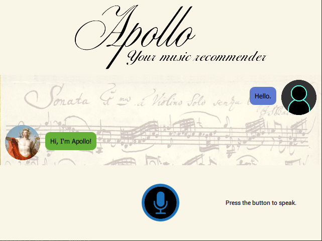

# Apollo

Apollo is a **conversational agent** in the form of a **Graphical User Interface** which has the goal to inform about classical music and make recommendations. It uses information from the online music database [Last.fm](https://www.last.fm/) and it follows its execution in 3 phases: 
* The Greeter, which greets the user and ask for its name
* The Suggester, which suggests musical periods, composers and give information about them
* The Closer, which farewells the conversation. The GUI is implemented in Python and QML languages and it uses sound effects and animation

This agent receives the user's inputs from the microphone and preprocesses it with the Speech Recognition and Punctuator libraries. Then, the Dialogue Manager of the agent tokenizes the data, tags the sentences and vectorizes them with Bag of Words by using the Natural Language Tool Kit (NLTK) library. This, classifies the dialogue in types of sentences and acts according to the information previously given. In order to generate the response, the agent uses a template base generator, which uses sample senteces with gaps filled by the model and then reproduce them with the text-to-speach library Pyttsx3. 

The information and questions from the user are stored in order to adapt the conversation to the previous dialogue, for example, by not repeating suggestions.

### GUI's capture ###

### Prerequisites ###

* Python3 (tested in 3.8)
* PySide2
* speech_recognition
* Punctuator
* pyttsx3

### Execution

To execute Apollo, run ``main.py``.
